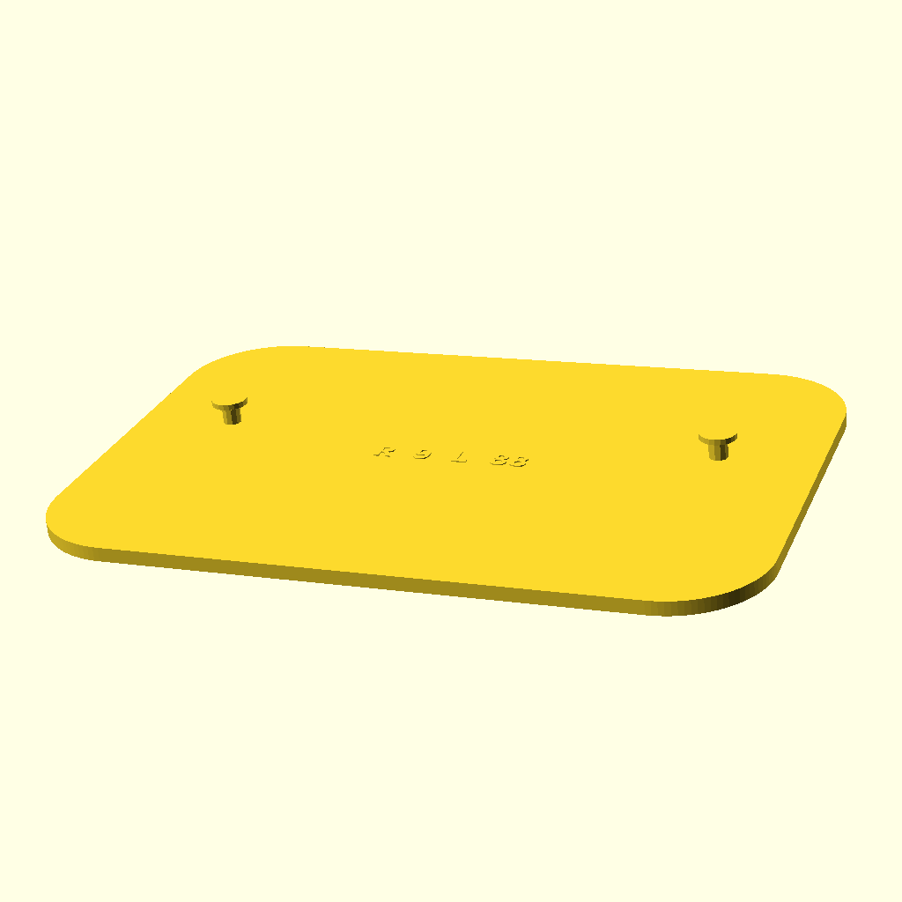
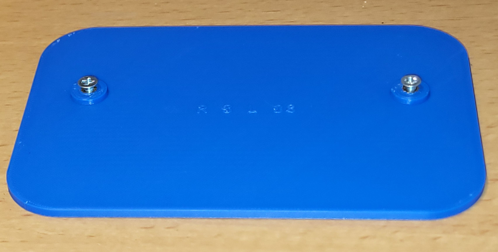
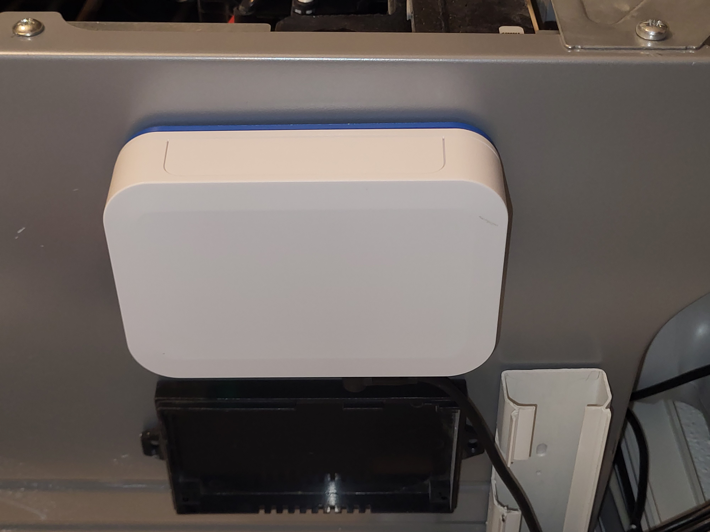

# Wallmount for "EMS Gateway E32 V2"
A simple customizable wallmount that aims to be glued down to the side of the headpump (inner part).
In my case this is a Buderus Logatherm WLW186i AR.

Written in openscad.

# Customizer
The openscad customizer can be used to create new flavours, though probably hardly used by this project.

# Printing
I printed with PLA, 20% infill.

# Source files

- Wallmount.scad
    The wallmount creator.
- Wallmount.json
    Defines sizes and models for flavours.
- svn_rev.scad
    Contains the subversion revision and is automatically created by the Makefile and SubWCRev (subwcrev).
    The revision string gets printed onto the wallmount.
- Makefile
    The control file for make (I use gmake on Linux, others not tested).

# Flavours

| Using heat inserts and M3 screws (recommended) | Using selftab M3 screws (also good choice) | printed pins (less robust)|
| :----: | :----: | :----: |
|  |  |   |
| Heat inserts M3x4, screws M3*6 with countersunk head | Selftab screws M3*6 with countersunk head (Din7500 or manual tab ) | No metal parts required |

Find the corresponding .stl files in the STL directory.

# Some real pictures

 # Rebuild
    Unzip the dfLibscad_xx.zip (xx==Revision. It is a .txt file on Thingiverse since it does not accept .zip) into the same directory that contains the scad and Makefile.
    You should get a new subdir named dfLibscad.
	On Github this above step is not required since the repo contains the directory.

    On Linux open a shell in the source directory, then type make and wait.
    The png and stl files will get created in subdirs. This takes a while, so be patient.
    On Windows, Mac, your are on your own.

    A manual rebuild with openscad is also possible, open Wallmount.scad in openscad, select a thing in the customizer (PrintThis) or add a new flavour with your sizes, press F6, wait, then F7 to export the stl.

    Manual build is to much work for me, therefore I created the Makefile.

    I do currently not know whether the customize of Thingiverse will work.

# Details on the Makefile
    It parses the json file to get the list of things/flavours to build.
    Then it creates pictures in PNG directory and the stl in STL directory.

    Not used by this project:
    It also checks for an auto-versioning template file (svn_rev.tmpl). If found, calls SubWCRev (see pysubwcrev below) to create svn_rev.scad. 
    I do not provide the template file (not useful for you), so this rule will not execute on your machine (I provide the svn_rev.scad instead).
    
    You might also notice that it checks for my library dfLibscad. If found, the libraries svn_rev.tmpl file gets translated into 
    another svn_rev.scad file with a version string of the library.
    Designs can use the module WriteRevision() to print the revision strings onto the part.

    I use this Makefile in other projects as well. Usually, just the very few first lines need to be adjusted.
    Feel free to reuse it.

## Requirements

- The Makefile expects openscad-nighly to be installed. I use it because it is faster.
For openscad stable, locate the two lines with "OPENSCAD ?=" and comment/uncomment the version you want.

    >"OPENSCAD ?= openscad-nightly"

    >"# OPENSCAD ?= openscad"

- On Linux, grep is installed by default, for poor OS you can use either cygwin or the WSL (untested).
    

# Github
    My github projects:
    https://github.com/FauthD?tab=repositories

	- https://github.com/FauthD/Wallmount-BBQKees-EMS-Gateway-E32-V2
    - pysubwcrev is a cross-platform version of subwcrev

